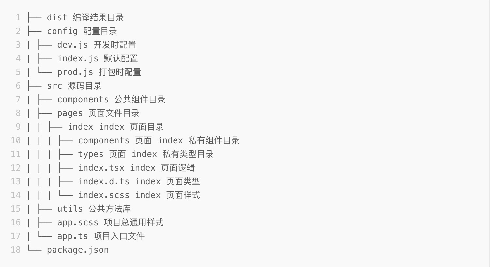
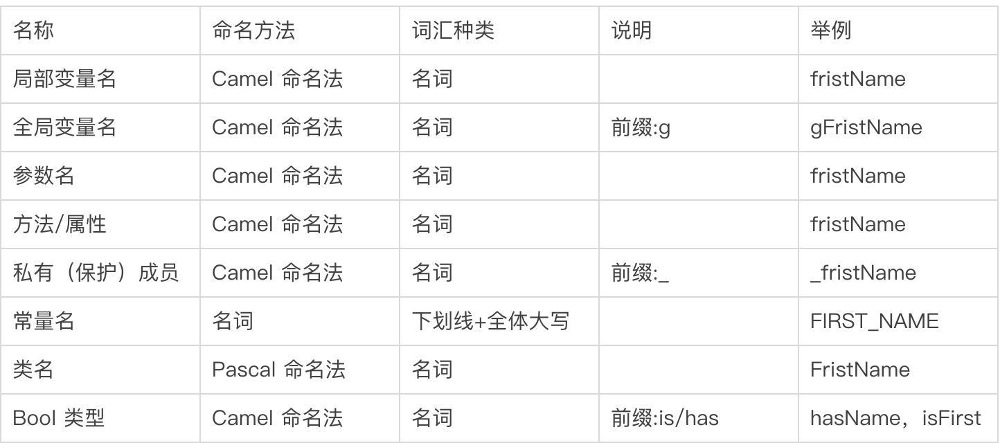
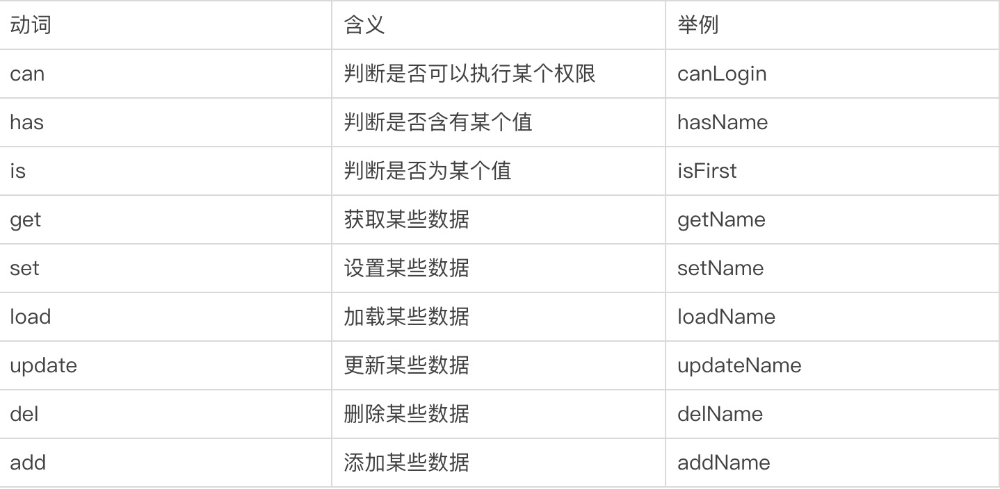

# Taro 小程序 代码规范

<h3 >1. 项目目录结构</h3>

<br> 

<h3 >2. 各类型命名规范</h3>

注意：在命名时尽量简洁明了，用英文表达（禁止使用首字母缩写、拼音或数字）

<br> 

<h3 >3. 函数与类的命名</h3>

使用 驼峰 命名法<br> 
名字应该明确表达改类的作用<br> 
前缀为动词，前缀词如下表所示<br> 

<br> 

<h3 >4. 文件命名规范</h3>

a. Taro 中普通 JS/TS 文件以小写字母命名，~~多个单词以下划线连接，例如 util.js、util_helper.js，~~这里经讨论修改为中划线命名法，例如 util-helper.js <br>
b. Taro 组件文件命名，~~官方文档建议遵循 React 开发规范，即 Pascal 命名法，例如 ReservationCard.jsx，~~这里建议按小程序规范，即中划线命名法，例如 reservation-card.jsx

<h3 > 5. 书写顺序 </h3>

在 Taro 组件中会包含类静态属性、类属性、生命周期等的类成员，其书写顺序最好遵循以下约定（顺序从上至下）
1. static 静态方法
2. constructor
3. componentWillMount
4. componentDidMount
5. componentWillReceiveProps
6. shouldComponentUpdate
7. componentWillUpdate
8. componentDidUpdate
9. componentWillUnmount
10. 点击回调或者事件回调 比如 onClickSubmit() 或者 onChangeDescription()
11. render

<h3 >6 组件创建</h3 >

Taro 中组件以类的形式进行创建，并且单个文件中只能存在单个组件


<h3 >7 属性书写</h3 >

属性名称始终使用驼峰命名法

```
    // bad
    <Foo
    UserName='hello'
    phone_number={12345678}
    />

    // good
    <Foo
    userName='hello'
    phoneNumber={12345678}
    />
```

<h3 >8 JSX 与括号 </h3 >

用括号包裹多行 JSX 标签

```
// bad
render () {
  return <MyComponent className='long body' foo='bar'>
           <MyChild />
         </MyComponent>
}

// good
render () {
  return (
    <MyComponent className='long body' foo='bar'>
      <MyChild />
    </MyComponent>
  )
}

// good
render () {
  const body = <div>hello</div>
  return <MyComponent>{body}</MyComponent>
}
```


<h3> 9 标签 </h3>

当标签没有子元素时，始终使用自闭合标签

```
// bad
<Foo className='stuff'></Foo>

// good
<Foo className='stuff' />
// 如果控件有多行属性，关闭标签要另起一行

// bad
<Foo
  bar='bar'
  baz='baz' />

// good
<Foo
  bar='bar'
  baz='baz'
/>
```

<h3> 10 对齐方式</h3>

多个属性，多行书写，每个属性占用一行，标签结束另起一行

```
// bad
<Foo superLongParam='bar'
     anotherSuperLongParam='baz' />

// good
<Foo
  superLongParam='bar'
  anotherSuperLongParam='baz'
/>

// 如果组件的属性可以放在一行就保持在当前一行中
<Foo bar='bar' />

// 多行属性采用缩进
<Foo
  superLongParam='bar'
  anotherSuperLongParam='baz'
>
  <Quux />
</Foo>
```

<h3>11 推荐使用对象解构的方式来使用 state、props</h3>

```
    import Taro, { Component } from '@tarojs/taro';
    import { View, Input } from '@tarojs/components';

    class MyComponent extends Component {
    state = {
        myTime: 12,
    };
    render() {
        const { isEnable } = this.props; // ✓ 正确
        const { myTime } = this.state; // ✓ 正确
        return (
        <View className="test">
            {isEnable && <Text className="test_text">{myTime}</Text>}
        </View>
        );
    }
    }
```

<h3>12 不要以 class/id/style 作为自定义组件的属性名</h3>

```
<Hello class='foo' />     // ✗ 错误
<Hello id='foo' />     // ✗ 错误
<Hello style='foo' />     // ✗ 错误
```

<h3>13 书写顺序不要使用 HTML 标签</h3>

```
<div className='foo'></div>     // ✗ 错误
<span id='foo' /></span>    // ✗ 错误
```

<h3>14 书写顺序不要在调用 this.setState 时使用 this.state</h3>

```
this.setState({
  value: this.state.value + 1,
}); // ✗ 错误

this.setState((prevState) => ({ value: prevState.value + 1 })); // ✓ 正确
```

<h3>15 map 循环时请给元素加上 key 属性 </h3>

```
list.map((item) => {
  return (
    <View className="list_item" key={item.id}>
      {item.name}
    </View>
  );
});
```


<h3>16 尽量避免在 componentDidMount 中调用 this.setState</h3>

```
import Taro, { Component } from '@tarojs/taro';
import { View, Input } from '@tarojs/components';

class MyComponent extends Component {
  state = {
    myTime: 12,
  };

  componentDidMount() {
    this.setState({
      // ✗ 尽量避免，可以在 componentWillMount 中处理
      name: 1,
    });
  }

  render() {
    const { isEnable } = this.props;
    const { myTime } = this.state;
    return (
      <View className="test">
        {isEnable && <Text className="test_text">{myTime}</Text>}
      </View>
    );
  }
}
```

<h3>17 不要在 componentWillUpdate/componentDidUpdate/render 中调用 this.setState</h3>

```
import Taro, { Component } from '@tarojs/taro';
import { View, Input } from '@tarojs/components';

class MyComponent extends Component {
  state = {
    myTime: 12,
  };

  componentWillUpdate() {
    this.setState({
      // ✗ 错误
      name: 1,
    });
  }

  componentDidUpdate() {
    this.setState({
      // ✗ 错误
      name: 1,
    });
  }

  render() {
    const { isEnable } = this.props;
    const { myTime } = this.state;
    this.setState({
      // ✗ 错误
      name: 11,
    });
    return (
      <View className="test">
        {isEnable && <Text className="test_text">{myTime}</Text>}
      </View>
    );
  }
}
```


<h3>18 组件最好定义 defaultProps</h3>

```
import Taro, { Component } from '@tarojs/taro';
import { View, Input } from '@tarojs/components';

class MyComponent extends Component {
  static defaultProps = {
    isEnable: true,
  };

  state = {
    myTime: 12,
  };

  render() {
    const { isEnable } = this.props;
    const { myTime } = this.state;

    return (
      <View className="test">
        {isEnable && <Text className="test_text">{myTime}</Text>}
      </View>
    );
  }
}
```

<h3>19 render 方法必须有返回值</h3>

```
import Taro, { Component } from '@tarojs/taro'
import { View, Input } from '@tarojs/components'

class MyComponent extends Component {
  state = {
    myTime: 12
  }

  render () {   // ✗ 没有返回值
    const { isEnable } = this.props
    const { myTime } = this.state

    <View className='test'>
      {isEnable && <Text className="test_text">{myTime}</Text>}
    </View>
  }
}
```

<h3>20 值为 true 的属性可以省略书写值</h3>

```
<Hello personal />
<Hello personal={false} />
```

<h3>21 事件绑定均以 on 开头</h3>

```
import Taro, { Component } from '@tarojs/taro';
import { View, Input } from '@tarojs/components';

class MyComponent extends Component {
  state = {
    myTime: 12,
  };

  clickHandler(e) {
    console.log(e);
  }

  render() {
    const { myTime } = this.state;

    return (
      <View className="test" onClick={this.clickHandler}>
        {' '}
        // ✓ 正确
        <Text className="test_text">{myTime}</Text>
      </View>
    );
  }
}
```

<h3>子组件传入函数时属性名需要以 on 开头</h3>

```
import Taro, { Component } from '@tarojs/taro';
import { View, Input } from '@tarojs/components';

import Tab from '../../components/Tab/Tab';

class MyComponent extends Component {
  state = {
    myTime: 12,
  };

  clickHandler(e) {
    console.log(e);
  }

  render() {
    const { myTime } = this.state;

    return (
      <View className="test">
        <Tab onChange={this.clickHandler} /> // ✓ 正确
        <Text className="test_text">{myTime}</Text>
      </View>
    );
  }
}

```

<h3>22 不能使用 Array#map 之外的方法操作 JSX 数组</h3>

```
numbers.filter(isOdd).map((number) => <View />);

for (let index = 0; index < array.length; index++) {
  // do you thing with array
}

const element = array.map((item) => {
  return <View />;
});
```

<h3>23 项目规范</h3>

1. 项目常量和枚举需要注释声明内容，方法上添加注释声明方法功能，方法行数大于十行说明方法具体内容
2. 类型建议添加 interface 或者 type 声明
3. 表单提交添加防抖，有订阅情况离开页面需销毁


<h3>24 taro 自定义 tabbar 状态管理不能用以前的小程序的逻辑，可通过如下写法去管理</h3>

```
if (typeof this.$scope.getTabBar === 'function' && this.$scope.getTabBar()) {
  this.$scope.getTabBar().$component.setState({
    selected: 'home',
  });
}
```