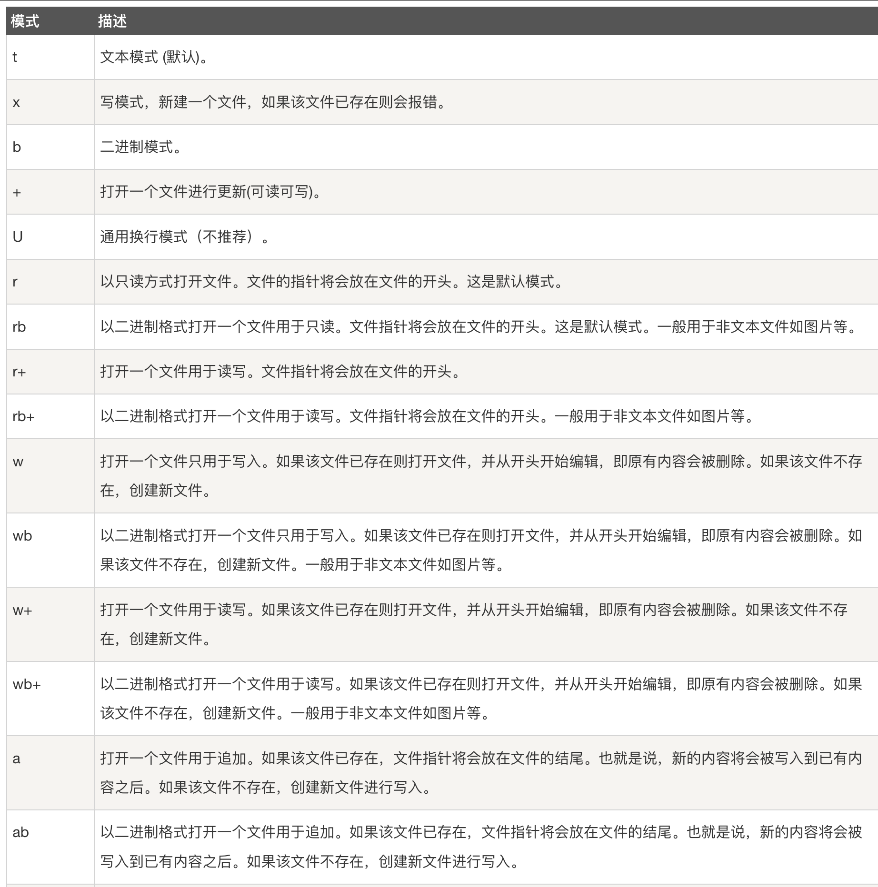

### 

```
# -----------------------------------------------------------

# !/usr/bin/env python
# -*- coding: utf-8 -*-
# @Time    : 2023/12/4 15:40
# @Author  : Dreamers
# @File    : study_file.py
# @Software: PyCharm

# ------------------------------------------------------------

# 本篇总结，在python语言中使用文件时的一些基本方法，和经常会用到对os模块

# 使用方法：open(file, mode)
# file:是要打开的目标文件名的字符串（可以包含文件所在的具体路径）
# mode：设置打开文件的模式（访问模式）：只读，写入，追加等
f = open('test.txt', 'r') # 默认只读

# 读写 .txt文件支持，pdf等格式不支持
# f.write('hello world')

# print('---f---', f) #---workbook--- <_io.TextIOWrapper name='test.txt' mode='w' encoding='UTF-8'>

# 使用读取方式时，open()方法的mode应为'r',否则报错。
# f.read()  # 读取第一行数据
f.readline() # 一次读取一行内容

f.seek(0,0)
readlines = f.readlines() # 可以按照行的方式把整个文件中的内容进行一次性读取，并且返回的是一个列表，其中每一行的数据为一个元素。
print('---', readlines) #['hello world\n', '1\n', '2\n']

# ⚠️读取文件三兄弟，read()\readline()\readlines(), 连续调用两次时，第二次调用返回[]
# 解决：因为在第一个read()之后，光标移到了文件的末尾，加入seek（0,0）即可正常

# 另外一种写文件方式： with open('文件名称'， 'r') as f
# Python引入了with语句来自动帮我们调用close()方法
with open('test.txt', 'r') as f:
    print('--readlines-', f.readlines()) # ['hello world\n', '1\n', '2\n']

# 关闭文件
f.close()

# ------------------- 分割线 -------------------

## 在项目实践中，想要操作某个文件，先得找到该文件的位置。如果写死路径，当代码移植到其他设备，
# 这些路径可能都要全部改写，代码维护成本高。Python的 os 模块提供函数可以获取到当前文件的绝对路径，从而定位到目标文件。
# os.path 模块主要用于获取文件的属性

import os
print(os.path.dirname(__file__)) # 返回目录路径  /Users/liuxiangdong/Desktop/pyStudyProject
base_path = os.path.dirname(__file__) # 把生成的报告放到reports目录下 /Users/liuxiangdong/Desktop/pyStudyProject/reports/test.txt
print(os.path.join(base_path, 'reports', 'test.txt')) # 将目录和文件名合成一个路径 /Users/liuxiangdong/Desktop/pyStudyProject/study_file.py
print(os.path.abspath(__file__)) # 输出绝对路径


#os.path.exists()判断文件或文件夹是否存在, 返回true/false
print(os.path.exists('/Users/liuxiangdong/Desktop/pyStudyProject/study_file.py'))


```

mdoe参数：
